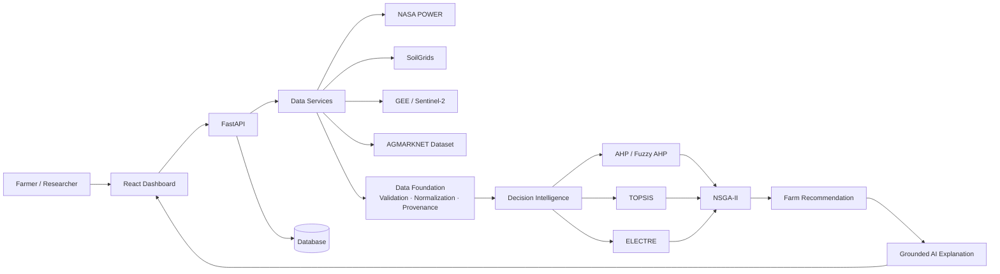
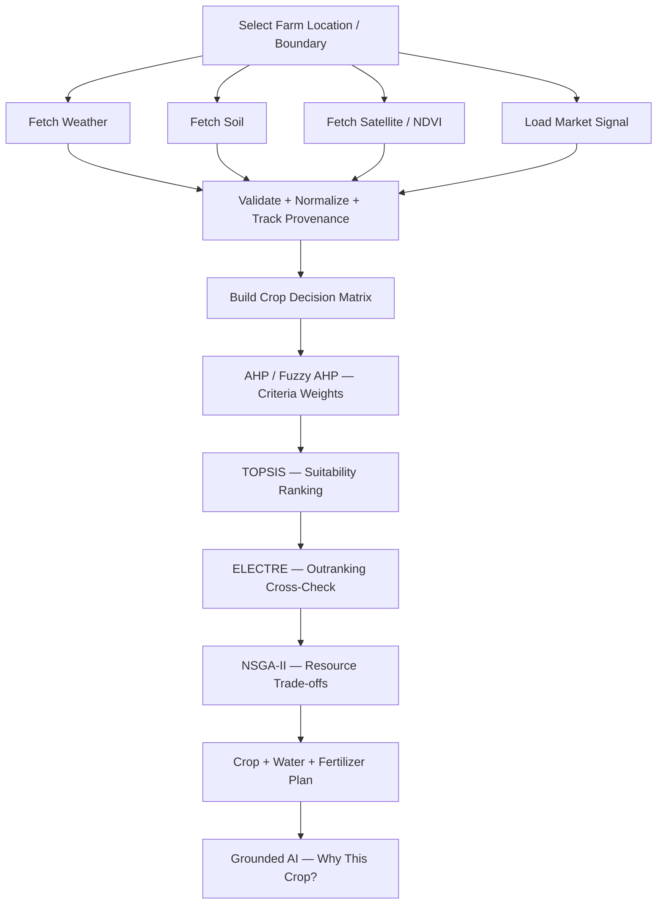
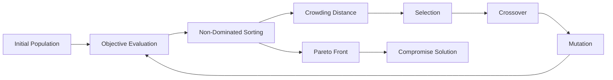
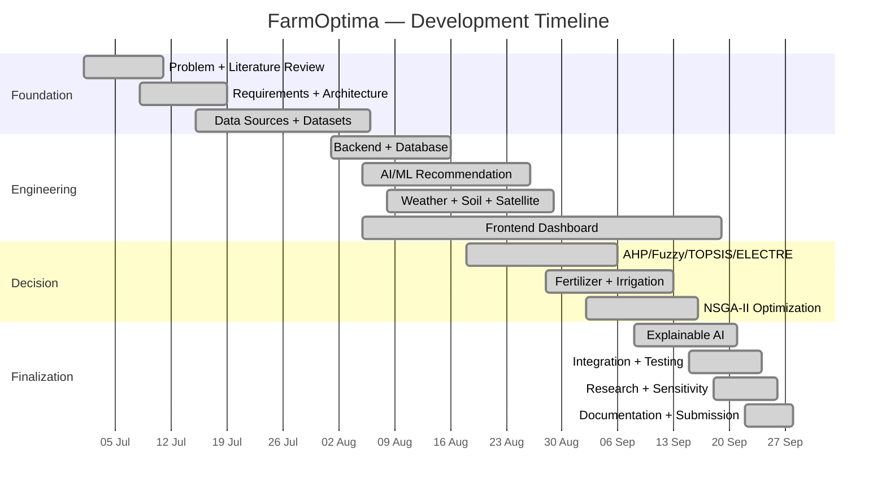

<div align="center">

# 🌾 FarmOptima

### AI-Powered Precision Agriculture Decision-Support Platform

*From farm data → decision intelligence → optimized resources → explainable action.*


</div>

---

**FarmOptima** is a full-stack agricultural decision-support system that fuses **soil, weather, satellite/NDVI, water, and market context** with **AHP · Fuzzy AHP · TOPSIS · ELECTRE · NSGA-II** to produce a farm-specific recommendation — **crop, irrigation, and fertilizer** — with a grounded explanation and full data provenance.

It is designed as an **evidence-driven decision system**, not merely a chatbot or a single crop-classification model.

## 📑 Table of Contents

- [Highlights](#-highlights)
- [System Architecture](#-system-architecture)
- [End-to-End Decision Pipeline](#-end-to-end-decision-pipeline)
- [Decision Intelligence (MCDM)](#-decision-intelligence-mcdm)
- [NSGA-II Optimization](#-nsga-ii-optimization)
- [Geospatial Intelligence](#-geospatial-intelligence)
- [Data Provenance & Freshness](#-data-provenance--freshness)
- [Explainable AI](#-explainable-ai)
- [Engineering & Reliability](#-engineering--reliability)
- [Technology Stack](#-technology-stack)
- [Project Structure](#-project-structure)
- [API Surface](#-api-surface)
- [Run Locally](#-run-locally)
- [Validation & Research](#-validation--research)
- [Project Timeline](#-project-timeline)
- [SDG Alignment](#-sdg-alignment)
- [Roadmap](#-roadmap)
- [Limitations & References](#-limitations--references)

---

## ✨ Highlights

| Data Intelligence | Decision Intelligence | Platform |
|---|---|---|
| 🌦️ Weather intelligence | 🧮 MCDM crop ranking | 💬 Grounded AI assistant |
| 🌱 Soil intelligence | 🧬 NSGA-II optimization | 🔎 Provenance / freshness |
| 🛰️ Satellite + NDVI | 💧 Irrigation planning | 🔐 JWT authentication |
| 📈 Market signal | 🧪 N-P-K fertilizer planning | 🚦 Rate limiting & validation |

> **Core design principle**
>
> `External Data → Data Foundation → Decision Intelligence → Multi-Objective Optimization → Farm Recommendation → Explainable AI`

---

## 🏗️ System Architecture



---

## 🔄 End-to-End Decision Pipeline



---

## 🧮 Decision Intelligence (MCDM)

Four complementary Multi-Criteria Decision-Making methods **cross-validate** the crop ranking rather than relying on a single algorithm.

| Method | Role |
|---|---|
| **AHP** | Criteria weighting + consistency analysis |
| **Fuzzy AHP** | Uncertainty-aware weighting workflow |
| **TOPSIS** | Distance-based crop suitability ranking |
| **ELECTRE** | Concordance / discordance-based outranking |

**Decision criteria:** Climate · Soil · Water Efficiency · Market

### Configured AHP Weights

| Criterion | Weight | Share |
|---|---:|---:|
| Climate | 0.4495 | 45% |
| Soil | 0.2596 | 26% |
| Water Efficiency | 0.1707 | 17% |
| Market | 0.1202 | 12% |

> [!IMPORTANT]
> These are the project's **configured decision weights**, not universal agronomic priorities. They are tunable inputs to the pipeline, with sensitivity analysis provided (see [Validation & Research](#-validation--research)).

---

## 🧬 NSGA-II Optimization

Resource planning is treated as a **multi-objective optimization problem**, producing a set of trade-off solutions instead of forcing every objective into one score.

| Objective | Direction |
|---|---|
| Water Gap | Minimize |
| Fertilizer Gap | Minimize |
| Monetary / Resource Cost | Minimize |



**Output:** a Pareto set of trade-off solutions, then a chosen compromise plan.

---

## 🛰️ Geospatial Intelligence

FarmOptima uses the farm as a **spatial context**, not merely a point — deriving vegetation insight from satellite imagery.

```text
Farm Location / Polygon → Google Earth Engine → Sentinel-2 Imagery
        → Band Processing → NDVI → Vegetation Insight → Recommendation Context
```

**Spatial stack:** Leaflet · OpenStreetMap · GeoJSON · Sentinel-2 · Google Earth Engine · NDVI

---

## 🔎 Data Provenance & Freshness

Every value carries **where it came from** and **how fresh it is** — live, cached, model-derived, or fallback.

**Soil evidence precedence** (highest-trust source wins):

```text
LAB_MEASUREMENT  >  MODEL_PREDICTION  >  CACHED_API  >  MOCK / FALLBACK
```

| Domain | Current Source | Current Status |
|---|---|---|
| Weather | NASA POWER | Live service + fallback |
| Soil | SoilGrids v2.0 | Model prediction |
| Soil lab | Verified lab record | Supported, higher precedence |
| Satellite | GEE / Sentinel-2 | Integrated + fallback handling |
| Market | AGMARKNET-derived CSV | Static historical / local dataset |
| Maps | OpenStreetMap | Integrated |

---

## 💬 Explainable AI

The AI assistant is the **explanation layer** above the recommendation engine — grounded in the structured farm context, not free-floating chat.

```text
Recommendation Engine → Structured Farm Context → Grounding / Context Builder
        → AI Assistant → Human-readable Explanation
```

The assistant can explain:

- Why this crop was recommended
- Which factors contributed to the decision
- How soil / weather / NDVI affected the recommendation
- What water and fertilizer actions are suggested
- Which data sources were used

---

## 🛡️ Engineering & Reliability

| Area | Practices |
|---|---|
| **Security** | JWT / Bearer authentication, password hashing, protected farm operations, rate limiting, environment secrets |
| **Architecture** | Thin API routes → service layer → pure core algorithms → database models → validated schemas |
| **Reliability** | Timeout handling, fallbacks, structured exceptions, Pydantic validation, provenance tracking |

> [!TIP]
> Clean separation of concerns keeps the MCDM / NSGA-II core **pure and testable** — decoupled from I/O, framework, and data-source details.

---

## 🧰 Technology Stack

| Layer | Technologies |
|---|---|
| **Frontend** | React, Vite, Tailwind CSS, Leaflet / React-Leaflet, Axios, Recharts |
| **Backend** | Python 3.12+, FastAPI, Pydantic, SQLAlchemy, Uvicorn, Pytest |
| **Intelligence** | Machine Learning, AHP, Fuzzy AHP, TOPSIS, ELECTRE, NSGA-II |
| **Geospatial & Data** | Google Earth Engine, Sentinel-2, SoilGrids, NASA POWER, AGMARKNET-derived dataset, OpenStreetMap |

---

## 📁 Project Structure

```text
FarmOptima/
├── backend/
│   ├── app/
│   │   ├── api/routes/        # thin HTTP routes
│   │   ├── core/              # pure algorithms (AHP, TOPSIS, ELECTRE, NSGA-II)
│   │   ├── models/            # SQLAlchemy models
│   │   ├── schemas/           # Pydantic schemas
│   │   ├── services/ai/       # data services + grounded AI
│   │   ├── utils/
│   │   ├── config.py
│   │   ├── database.py
│   │   └── main.py
│   ├── tests/
│   ├── requirements.txt
│   └── .env.example
├── frontend/                  # React + Vite + Tailwind dashboard
│   ├── src/
│   ├── public/
│   ├── package.json
│   └── vite.config.*
├── scripts/                   # research + benchmark runners
│   ├── run_research_evaluation.py
│   ├── run_optimization_comparison.py
│   └── run_sensitivity_analysis.py
├── reports/                   # generated results (JSON + MD)
├── docs/
└── README.md
```

---

## 🔌 API Surface

| Endpoint | Method | Purpose |
|---|---|---|
| `/api/auth/register` | `POST` | User registration |
| `/api/auth/login` | `POST` | Login + token |
| `/api/weather` | `GET` | Weather context |
| `/api/soil` | `GET` | Soil context |
| `/api/satellite` | `GET` | Satellite / NDVI context |
| `/api/farms` | `GET` / `POST` | Saved farms |
| `/api/farms/{farm_id}/soil-tests` | `POST` | Verified soil test |
| `/api/recommend` | `POST` | Main recommendation pipeline |
| `/api/ai/chat` | `POST` | Grounded AI assistant |

**Docs:** Swagger UI → <http://localhost:8000/docs> · OpenAPI → <http://localhost:8000/openapi.json>

---

## 🚀 Run Locally

### 1. Clone

```bash
git clone https://github.com/MITHLESH55/FarmOptima.git
cd FarmOptima
```

### 2. Backend (FastAPI on port 8000)

```bash
cd backend
python -m venv .venv

# Windows
.venv\Scripts\activate

# macOS / Linux
source .venv/bin/activate

pip install -r requirements.txt

# Windows: copy .env.example .env  |  macOS / Linux: cp .env.example .env
cp .env.example .env

uvicorn app.main:app --reload --port 8000
```

### 3. Frontend (React + Vite on port 5173)

```bash
cd frontend
npm install
npm run dev
```

| Service | URL |
|---|---|
| Frontend | <http://localhost:5173> |
| Backend | <http://localhost:8000> |

---

## ✅ Validation & Research

| Check | Result |
|---|---|
| Backend automated tests | **340 / 340 passed** |
| Frontend production build | Passed |
| Research pipelines | **3 / 3 passed** |
| Submission / documentation dossier | Complete |

```bash
# Backend tests
cd backend && pytest

# Frontend build
cd frontend && npm run build

# Research evaluation
python scripts/run_research_evaluation.py
python scripts/run_optimization_comparison.py
python scripts/run_sensitivity_analysis.py
```

### MCDM Evaluation — 6 Indian Agro-Climatic Zones

| Metric | Observed |
|---|---:|
| Crisp AHP ↔ Fuzzy AHP mean Spearman ρ | 0.9768 |
| Equal-weight TOPSIS ↔ Fuzzy AHP correlation | 0.8241 |
| Fuzzy AHP ↔ ELECTRE cross-check correlation | 0.9105 |
| Top-1 agreement: Crisp vs Fuzzy AHP | 100% |
| Mean algorithm execution | < 1.5 ms |

### Optimization Benchmark

| Metric | Observed |
|---|---:|
| Non-dominated solutions | ~40 |
| Average water gap | 18.2% |
| Average fertilizer gap | 10.5% |
| Benchmark execution | ~625 ms |

> [!NOTE]
> Results come from the project's documented benchmark configuration. Optimizer settings can differ between application defaults and research benchmark scripts.

---

## 🗓️ Project Timeline

**01 July 2026 → 27 September 2026**



---

## 🌍 SDG Alignment

| SDG | Relevance |
|---|---|
| **SDG 2** — Zero Hunger | Food production and agricultural decision support |
| **SDG 6** — Clean Water | Water-aware irrigation planning |
| **SDG 9** — Industry & Innovation | AI, GIS, remote sensing and engineering innovation |
| **SDG 12** — Responsible Consumption | Resource-efficient fertilizer / water planning |
| **SDG 13** — Climate Action | Climate-aware agricultural decisions |

---

## 🗺️ Roadmap

| Near-term | Future Research |
|---|---|
| PostgreSQL-first deployment | IoT sensors · drone imagery |
| Historical recommendation tracking | Disease detection |
| Expanded spatial analytics | Field-validated yield prediction |
| Production observability | Multilingual voice assistant · mobile app |

---

## ⚠️ Limitations & References

### Current Limitations

- **Market** — uses a curated historical / local AGMARKNET-derived CSV rather than a live intraday mandi stream.
- **Soil** — SoilGrids provides regional model predictions; verified laboratory measurements take higher precedence.
- **Satellite** — cloud cover and source availability can affect observations, so fallback handling is used where appropriate.
- **Yield** — optimization aligns resource allocation with reference targets; it is not a validated field-trial yield guarantee.

> [!CAUTION]
> **Responsible use:** FarmOptima is a decision-support system. Recommendations should be weighed alongside local conditions, current advisories, soil testing, and professional agronomic guidance.

### Methodology References

| Method | Reference |
|---|---|
| AHP | Saaty — *Analytic Hierarchy Process* |
| Fuzzy AHP | Chang — *Fuzzy AHP extent-analysis methodology* |
| TOPSIS | Hwang & Yoon |
| ELECTRE | Roy — *Outranking* |
| NSGA-II | Deb et al. (2002) |
| Water management | FAO-56 / CROPWAT-oriented references |
| Nutrients | ICAR / agricultural-university recommendations |

---

## 👥 Contributors

Built by [MITHLESH55](https://github.com/MITHLESH55) and contributors.

---

<div align="center">

### 🌾 From Raw Farm Data to Explainable Decisions

**AI · ML · GIS · Remote Sensing · MCDM · Optimization · Explainable AI**

*Built as a final-year engineering project focused on practical AI, intelligent decision-making, and sustainable resource planning.*

</div>
